  

  

  ---
 <h2 align="center">Let's Connect</h2>

 &nbsp;&nbsp;

  
&nbsp;&nbsp;
  &nbsp;&nbsp; &nbsp;&nbsp;

  
&nbsp;&nbsp;
  &nbsp;&nbsp; &nbsp;&nbsp;

  
&nbsp;&nbsp;
  &nbsp;&nbsp; &nbsp;&nbsp;

  
&nbsp;&nbsp;
  &nbsp;&nbsp; &nbsp;&nbsp;

  
&nbsp;&nbsp;
  &nbsp;&nbsp; &nbsp;&nbsp;

  
&nbsp;&nbsp;
  &nbsp;&nbsp; &nbsp;&nbsp;

  

&nbsp;&nbsp;
&nbsp;&nbsp;

&nbsp;

## Community Contributions

  

---

## Primary Profile

  

